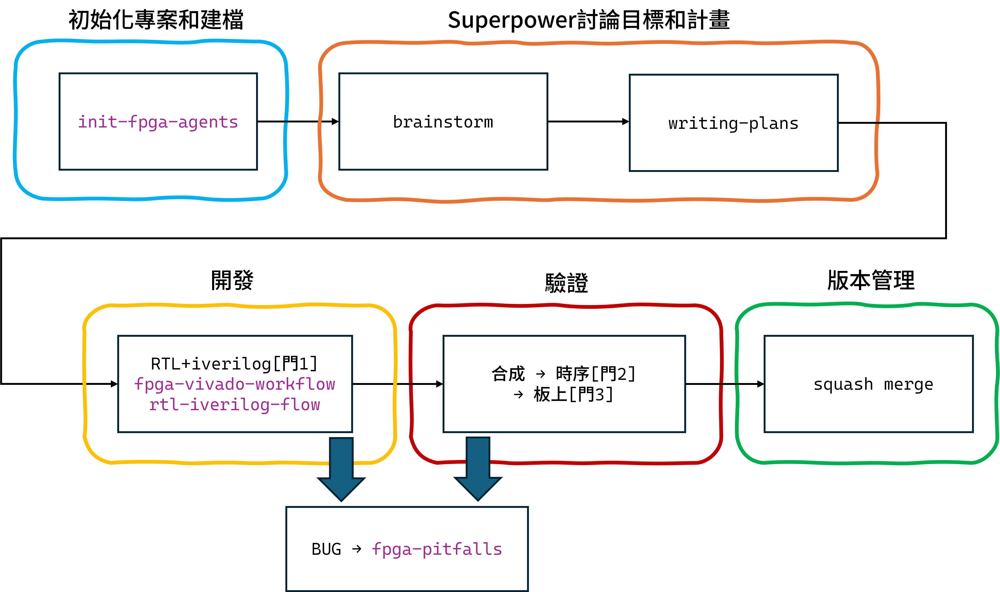

# fpga-design-flow

> 讓全實驗室用**同一套流程、同一套專案結構**開發 FPGA。
> 從建檔（標準目錄 + .gitignore）、規劃、RTL 模擬到合成與板上驗證，每一步都有把關；踩過的坑寫成知識庫，下一個人不必重踩。
> harness 中立，支援 Claude Code 與 Codex。

## 為什麼需要它
- **流程不統一**：每個人開發步驟不同，交接、review、品質都難一致
- **專案結構各搞各的**：檔案放哪沒共識，接手別人的專案要重新摸索
- **驗證靠自律**：模擬/時序/板上沒有強制把關，容易漏到燒板才爆
- **經驗綁個人**：踩坑紀錄散落各處，人一走就沒了

## 用起來像什麼
開新專案時，agent 先幫你**建出標準目錄結構**（src/sim/constraints/docs/… + .gitignore）和指令檔，全實驗室專案長得一致。之後你要改一個模組，它不會直接寫 code——先帶你釐清設計、出計畫；接著開 branch、改 RTL，**iverilog 沒過不准進合成**；合成後**時序 WNS 沒過不准燒板**；板上驗證通過後，**它停下來等你說「可以合併」才收尾**。撞到 Vivado/Vitis 錯誤，它自動翻踩坑知識庫找解法——查不到、你自己解掉後，再把新坑回寫進知識庫給下一個人。

## 開發流程


## 安裝

### Claude Code
1. `/plugin marketplace add https://github.com/willybb0120/fpga-design-flow`
2. `/plugin install fpga-design-flow`

### Codex App
- 側欄 Plugins → 加入此 repo → 安裝 `fpga-design-flow`

### Codex CLI
1. `codex plugin marketplace add https://github.com/willybb0120/fpga-design-flow`
2. `codex plugin install fpga-design-flow`

> Codex 讀 `AGENTS.md`、Claude Code 讀 `CLAUDE.md`；`init-fpga-agents` 以 AGENTS.md 為主檔並另建 CLAUDE.md，兩邊通用。

## 四個 skill 何時用
| skill | 何時用 |
|-------|--------|
| init-fpga-agents | 開新 FPGA 專案，建標準目錄 + .gitignore + AGENTS.md（+ CLAUDE.md）+ 結果模板 |
| fpga-vivado-workflow | 改 RTL 走完整 Vivado+Vitis 流程（含三道門） |
| rtl-iverilog-flow | 只做 RTL+iverilog 驗證（其他平台/簡單專案） |
| fpga-pitfalls | 遇 Vivado/Vitis/時序錯誤查解法 |

## 標準專案結構（init-fpga-agents 自動建立）
```
<project>/
├── AGENTS.md / CLAUDE.md   指令檔（強制規則 + 路徑對照 + 流程）
├── .gitignore              忽略 Vivado/Vitis 產出物
├── src/                    RTL 源碼 (.v)
├── sim/                    testbench + 模擬
├── constraints/            .xdc
├── ip_src/                 自訂 IP 源碼
├── docs/                   specs/ + plans/ + result-record.md
├── scripts/                建置/輔助腳本
├── vivado_workspace/       Vivado 專案
└── vitis_workspace/        Vitis 應用
```

## 設計原則
- **先規劃再動手**：先 brainstorm 出 spec 與 plan，不直接跳進 code
- **三道門紀律**：模擬 / 時序 / 板上，每道沒過不前進
- **資料與程序分離**：踩坑知識庫獨立成長，不污染工作流程
- **分發中立**：不綁任何人的私有路徑與單一 harness

## 環境需求
- Vivado / Vitis（合成與板上驗證）
- iverilog（RTL 模擬）
- Claude Code 或 Codex
- 開發環境：WSL / Linux（路徑範例以此為準）

## 更新
- 取得新版：`/plugin marketplace update fpga-design-flow` → 更新 plugin
- ⚠️ 本機 cache 的改動不會自動上傳、且更新時會被覆蓋

## 貢獻新踩坑（知識庫隨實驗室成長）
1. 遇到新坑、解決 → agent 用 fpga-pitfalls 條目模板草擬條目
2. commit 到 fork/branch → 開 PR
3. 維護者審核 diff → 合併 → 版本 +1 → push
4. 其他人更新 plugin 即取得新條目

## License
MIT
